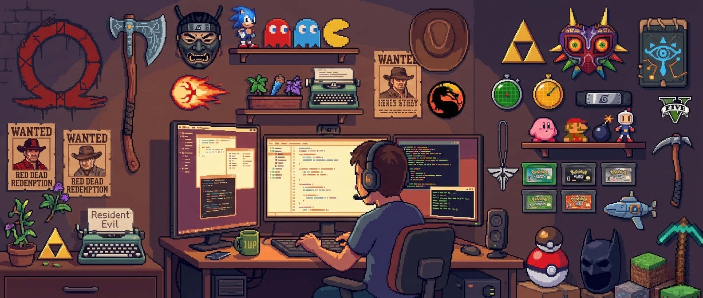

  

  

---

### 🕹️ Character Select: Manuel Enrique Antias Rodríguez

> *"Engineering is the closest thing to magic that exists in the real world."*

¡Hola! 👋 Soy estudiante de **Ingeniería Informática** en la **UCAB (Caracas)**. Mi "Main Quest" actual es graduarme y desarrollar soluciones que unan el mundo digital con el físico.

Combino la disciplina de la ingeniería con la creatividad del desarrollo de videojuegos y la robótica. No solo escribo código; construyo sistemas.

* 🔭 **Misión Actual:** Profundizando en **Robótica & IoT** con el Club de Robótica.
* ⚡ **Habilidad Especial:** Integración de **IA Generativa** (Gemini, Claude) para potenciar el desarrollo de software.
* 👾 **Hobby:** Desarrollo de circuitos, Pixel Art y Gaming.

---

### ⚔️ Inventory & Skill Tree

Aquí está mi arsenal tecnológico. He clasificado mis herramientas como si fueran clases de un RPG.

### 👨‍💻 Languages
<h2>👨‍💻 Languages</h2> 

  <marquee behavior="scroll" direction="left" scrollamount="12" width="100%">
    
    &nbsp; &nbsp; &nbsp; &nbsp;
    
    &nbsp; &nbsp; &nbsp; &nbsp;
    
    &nbsp; &nbsp; &nbsp; &nbsp;
    
    &nbsp; &nbsp; &nbsp; &nbsp;
     
    &nbsp; &nbsp; &nbsp; &nbsp;
    
    &nbsp; &nbsp; &nbsp; &nbsp;
    
    &nbsp; &nbsp; &nbsp; &nbsp;
    </marquee>

---

### 🏗️ Servers & Frameworks 

  <marquee behavior="scroll" direction="left" scrollamount="12" width="100%">
    
    &nbsp; &nbsp; &nbsp; &nbsp;
    
    &nbsp; &nbsp; &nbsp; &nbsp;
    
    &nbsp; &nbsp; &nbsp; &nbsp;
    
    &nbsp; &nbsp; &nbsp; &nbsp;
    
    </marquee>

---

### 🛠️ Some Tools

  <marquee behavior="scroll" direction="left" scrollamount="12" width="100%">
    
    &nbsp; &nbsp; &nbsp; &nbsp;
    
    &nbsp; &nbsp; &nbsp; &nbsp;
    
    &nbsp; &nbsp; &nbsp; &nbsp;
    
    &nbsp; &nbsp; &nbsp; &nbsp;
     
    &nbsp; &nbsp; &nbsp; &nbsp;
    
    &nbsp; &nbsp; &nbsp; &nbsp;
    
    </marquee>

---

### 🔮 AI Co-Pilots

  <marquee behavior="scroll" direction="left" scrollamount="12" width="100%">
    
    &nbsp; &nbsp; &nbsp; &nbsp;
    
    &nbsp; &nbsp; &nbsp; &nbsp;
    
    </marquee>

---

### 🔌 Hardware Lab (Robótica)
*Mis experimentos uniendo bits y átomos.*

| Proyecto | Descripción | Tech |
| :--- | :--- | :--- |
| **🤖 [Nombre Robot]** | Robot autónomo con sensores | Arduino, C++ |
| **🏠 [Sistema IoT]** | Control domótico vía web | ESP32, Angular |
| **🎮 [Tinkercad]** | Mis simulaciones de circuitos | [Ver Perfil](TU_LINK_TINKERCAD) |

---

### 🏆 Scoreboard (Estadísticas)

  
  
  

  

---

### 🐍 Contributions

---

### 📡 Start Connection

  
  

